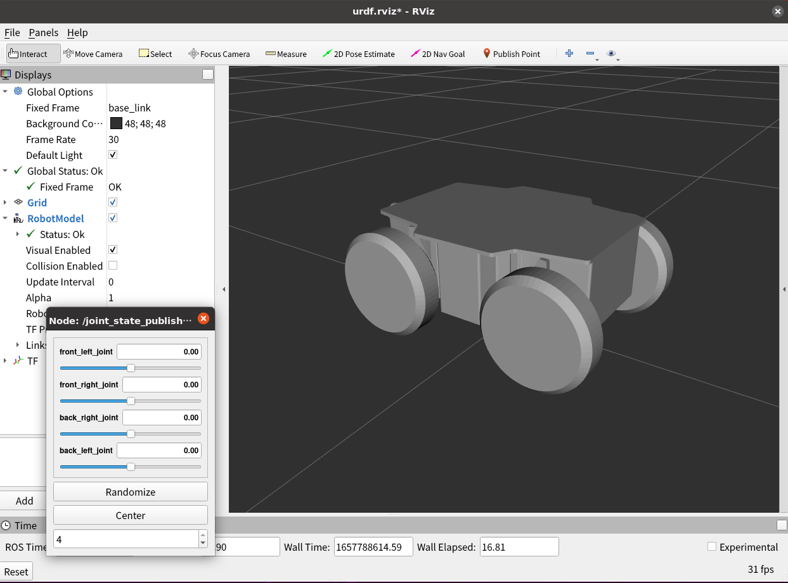

# メカナムローバーの3Dモデルのパッケージ

## 準備
ヴイストンの台車ロボットのオプションを表示する場合は、`vs_rover_options_description`というパッケージを`src`フォルダーにクローンしてください。（詳細は[こちら](https://github.com/vstoneofficial/vs_rover_options_description.git)を参照してください）
```bash
git clone https://github.com/vstoneofficial/vs_rover_options_description.git
```
> 1. 対応するオプション
>       - LRF TG30
> 
> 2. 使用状況に応じて、[mecanum3.xacro](./urdf/mecanum3.xacro)ファイルの8行目にある使用しないオプションをコメントアウトしてください。

## RViz上の可視化
以下のコマンドで立ち上げます。\
### メカナムローバーVer 3.0の場合は
```bash
roslaunch mecanumrover_description display.launch
```

